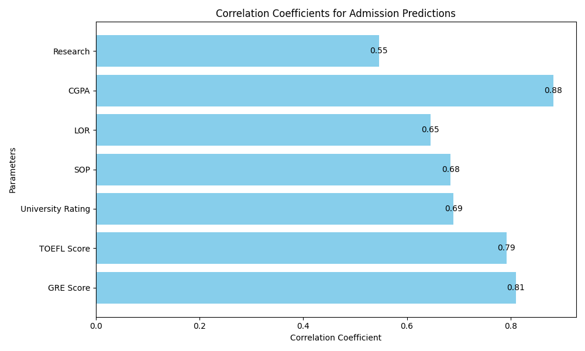
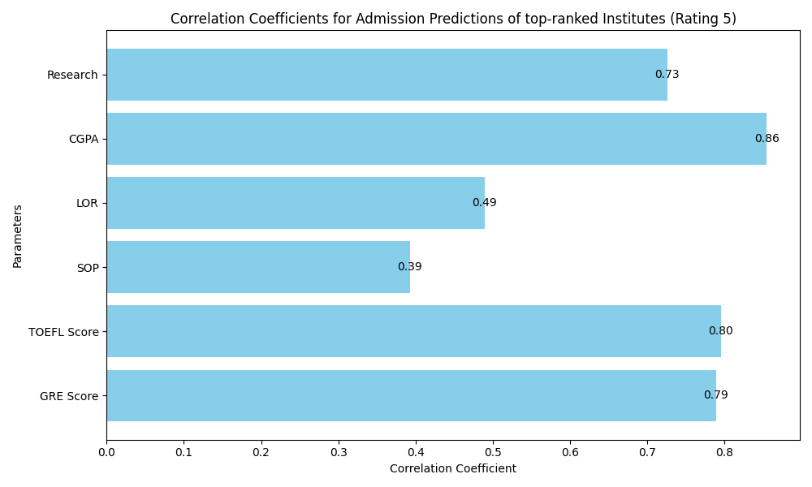

# Admission Prediction Analysis

## Code Overview

### Data Reading and Linear Regression

- The code reads the dataset from a CSV file using the Python `csv` module.
- It extracts numerical values from the dataset and converts them into NumPy arrays for further analysis.
- The matrix `M` is created, which includes the features (GRE Score, TOEFL Score, University Rating, SOP, LOR, CGPA, Research) and an intercept term.
- Linear regression is performed using the `np.linalg.lstsq` function to calculate the coefficients.
- A prediction function is defined to make predictions for the chance of admit using the obtained coefficients.

## Analysis

1. **Linear vs. Nonlinear Modeling:**

    - A linear fit may provide a reasonable approximation to predict the chance of admission based on the given features.
    - A linear model was chosen as a starting point for predicting admission chances due to its simplicity and interpretability. It provides a foundation for understanding how individual features contribute to the prediction. 
    - If the relationships are nonlinear, more complex models, such as polynomial regression or machine learning algorithms, may be considered for better predictive accuracy. 
    - Nonlinear models can add complexity, and their interpretation may be less straightforward. However, further analysis should explore the linearity of relationships in the data and consider more advanced modeling techniques if necessary.
    
2. **Predictive Capability:**

    - The model we've fitted provides a strong predictive capability for estimating a student's chance of admission based on the provided parameters. This predictive capability is demonstrated through the following key aspects:

    - **Mean Square Error (MSE):** The model yields a low Mean Square Error, indicating that the fit is remarkably close to the actual data points. A low MSE implies that the model can effectively capture the underlying patterns in the data and make accurate predictions.
    
    `Mean Square Error : 0.0035407508622541045`

    - **Root Mean Square Error (RMSE):** In addition to a low MSE, the model also demonstrates a low Root Mean Square Error. RMSE provides a measure of how well the model's predictions align with the actual data points. A low RMSE indicates that the model's predictions are consistently close to the true values, enhancing its reliability as a predictive tool.
    
     `Root Mean Square Error : 0.05950420877764954`

3. **Relationship between Parameters:**
   - In this analysis, we examine the correlation coefficients between various parameters (GRE Score, TOEFL Score, etc.) and the "Chance of Admission" to determine which factors have the most significant impact on the likelihood of being admitted to a University.

      {width = 50%}

   - Based on the correlation coefficients, we can draw the following conclusions:
      1. **CGPA has the strongest positive impact on the "Chance of Admission."** The higher the CGPA, the more likely an applicant is to be admitted.
      2. **GRE Score and TOEFL Score are also highly influential factors.** Applicants with higher GRE and TOEFL scores are more likely to be admitted.
      3. **University Rating, SOP, and LOR also have a positive impact on admission chances**, but their influence on the chance of admit are slightly lower than those of CGPA, GRE, and TOEFL.
      4. **Research Experience has a positive impact, but the correlation is weaker than other factors.** Applicants with research experience are more likely to be admitted, but this factor is less influential than the ones mentioned above.
      5. The "Chance of Admission" is most strongly associated with academic performance (CGPA, GRE, TOEFL), suggesting that focusing on academic excellence is essential for improving admission prospects.
      6. While Research Experience is beneficial, it is not as critical as the other factors.
   - In summary, to maximize your chances of admission, it is crucial to excel academically in GRE, TOEFL and have a good CGPA.

   - Intercept term has a negative effect, suggesting that there may be an offset in the model that decreases the chance of admission. In other words, it suggests that if a student had all features at their lowest possible values (e.g., the lowest GRE score, TOEFL score, University Rating, SOP, LOR, CGPA, and no research experience), the model predicts a negative chance of admission. This doesn't necessarily have a straightforward real-world interpretation, as a negative chance of admission doesn't make sense. It might indicate that there are unaccounted factors or that the model doesn't fit the data perfectly. Negative intercepts can sometimes be a sign of model misspecification, and it's essential to consider the context and data when interpreting them.

### Analysis for Top-Ranked Institutions (Rating 5)
The following correlation coefficients represent the relationship between each parameter and the "Chance of Admission" for top-ranked institutions (Rating 5):

{width = 50%}
Based on the correlation coefficients for top-ranked institutions (Rating 5), we can draw the following conclusions:

1. **CGPA remains the most influential factor.** A high CGPA is crucial for admission to top-ranked institutions.

2. **GRE Score and TOEFL Score also have significant positive impacts.** These standardized test scores continue to be highly relevant for admission.

3. **Research Experience has a positive influence.** However, it is not as decisive as the academic scores (GRE, TOEFL, CGPA).

4. **SOP and LOR also play a role**, but their influence are relatively lower.
