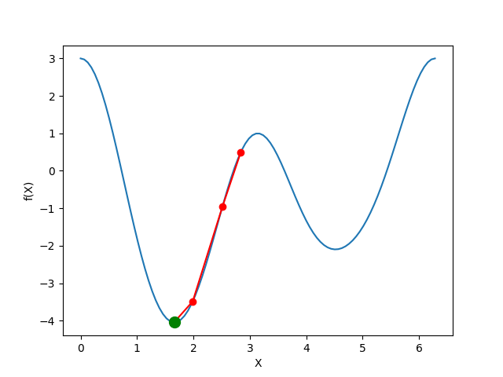
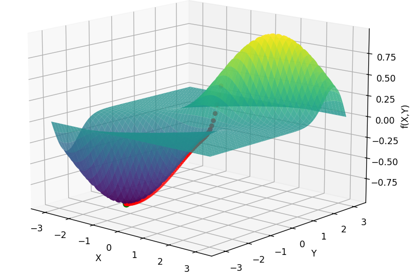

# Gradient Descent Documentation

---

## Gradient Descent : 
Gradient descent is a fundamental optimization technique used to find the minimum of a function iteratively. It operates by calculating the gradient (slope) of the function at a current point and takes steps in the direction of the steepest decrease to reach the lowest point (the minimum).

## 1D Polynomial :

The `graddesc_1d` function performs gradient descent optimization in one dimension and visualizes the process using Matplotlib.

**Parameters**
- graddesc_1d($f$, $x$-range, $f$~x~)
- **$f$ :** The objective function to minimize.
- **x_range :** Secifying the range of x-values for visualization.
- **derivative (optional) :** A custom function to provide the derivative of the objective function. If not provided, the code approximates the derivative numerically.

Inside the `graddesc_1d function`, the following steps are performed:

1. It creates a range of $x$-values within the specified range and computes the corresponding $y$-values using the objective function $f$.

2. It *randomly initializes* the starting point for gradient descent (bestx) and sets up a Matplotlib figure for visualization.

3. It defines a function `numeric_derivative` to approximate the derivative of $f$ numerically using the finite difference method.

4. The `onestepderiv` function is used as an animation frame. It updates the current bestx by subtracting the gradient times the learning rate (lr). It also computes the corresponding y value and updates the visualization.

### a ) Simple polynomial :
### $f1 = x ^ 2 + 3x + 8$

- **Learning rate (lr) :**

  * The choice of the learning rate affects the convergence of the optimization. 
  * If the learning rate is too small, convergence may be slow. If it's too large, convergence may be unstable or overshoot the minimum.
  * A learning rate of 0.1 strikes a balance between convergence speed and stability. It allows the algorithm to make reasonably sized steps in the direction of the gradient without diverging or converging too slowly.

- **Iterations :**

  * The number of iterations determines how finely the gradient descent process is visualized.
  * A larger number of iterations provides a more detailed view of the optimization path, whereas a smaller number of frames can make the animation more computationally efficient.
  * 200 frames were chosen in this code to strike a balance between providing a smooth and informative animation of the gradient descent process while remaining practical for computational efficiency.

- **Result :**

  * bestx  &asymp; $- 1.5$.
  * Minimum value  = $f(bestx)$ &asymp; $5.75$.

### b) Trigonometric polynomial :

### $f2 = cos^4(x) - sin^3(x) - 4sin^2(x) + cos(x) + 1$

- **Learning rate (lr) :**

  * In this code, a learning rate of 0.1 has been set, and it appears to be a reasonable choice for the given problem and function $f5$.
  * It typically allows for smooth convergence without taking overly large steps or causing divergence. 

- **Iterations :**

  -  In this, you may not need a large number of iterations to reach a satisfactory solution. An iteration of 200 is conisidered reasonable for this optimization process

- **Observation :**

  - In case of more than one minima in the given range,  it is crucial to note that the local minimum achieved through gradient descent in one dimension can vary depending on the initial starting point.

- **Result :**

  - bestx  &asymp; $1.6$ and $4.5$ depending on the starting points.
  - Minimum value  = $f(bestx)$ &asymp; $-4$ and $-2$ respectively.

## 2D Polynomial :

The `graddesc_2d` function performs gradient descent optimization in two dimension and visualizes the process using Matplotlib.

**Parameters**
- graddesc_2d($f$, $x$-range, $y$-range, $f$~x~, $f$~y~)
- **$f$ :** The objective function to minimize.
- **x-range and y-range**: Specifying the ranges of $x$ and $y$ for visualization.
- **derivative functions (optional) :** A custom function to provide the derivative of the objective function. If not provided, the code approximates the derivative numerically.

Gradient descent in two dimensions (2D) operates similarly to its one-dimensional (1D) counterpart, but extends the process to optimize functions with two variables.

### a ) $f3 = x^4 - 16x^3 + 96x^2 - 256x + y^2 - 4y + 262$

- **Learning rate (lr) :**
  - In this code, a learning rate of 0.001 (lr = 0.001) has been set as this choice of the learning rate can significantly impact the convergence and stability of the optimization process.

- **Iterations :**
  - The number of iterations in the code is set to 10,000 for the purpose of demonstrating the gradient descent process visually and allowing for thorough exploration of the optimization path.

- **Result :**

  - bestx  &asymp; $4$
  - besty  &asymp; $2$
  - Minimum value  = $f(bestx, besty)$ &asymp; $2$.

### b ) $f4 = e^{-(x - y)^2} \sin(y)$

- **Learning rate (lr) :**
  - In this code, a learning rate of 0.1 has been set, and it appears to be a reasonable choice for the given problem and function $f4$.

- **Iterations :**

  - 1500 frames were chosen in this code to strike a balance between providing a smooth and informative animation of the gradient descent process while remaining practical for computational efficiency.

- **Result :**

  - bestx  &asymp; $1.57$
  - besty  &asymp; $- 1.57$
  - Minimum value  = $f(bestx, besty)$ &asymp; $-1$.

