# Image Reconstruction using Delay-and-Sum(DAS) Algorithm

This project simulates the propagation of acoustic waves from a source, reflecting off an obstacle, and being captured by an array of microphones. It employs the Delay-and-Sum algorithm for signal processing and visualization.

### Key Components:

1. **Waveform Generation**:
   - Creation of sinc waveforms to simulate sound waves with adjustable parameters.
   - Visualization of the sinc waveforms over time to analyze their shape and characteristics.

2. **Microphone Array Setup**:
   - Definition of a linear microphone array with configurable spacing (pitch).
   - Calculation of time delays for sound waves traveling from the source to the obstacle and then to each microphone.

3. **Sample Generation**:
   - Simulation of sound wave reflections captured by each microphone using the Delay-and-Sum algorithm.
   - Generation of time-series data representing the received signals at each microphone, incorporating calculated time delays.

4. **Visualization**:
   - Plotting the reflected waveforms received by each microphone over time for detailed time-domain analysis.
   - Heatmap representation of the captured signals, showing the amplitude distribution across microphones and time samples.
   - Reconstructed image based on delayed and summed signals from the microphone array, providing a visual representation of the acoustic scene.

### Key Features:
- Adjustable parameters for waveform shape, microphone array configuration, and sound wave speed.
- Detailed plots of received signals for individual microphones, demonstrating the impact of time delays.
- Heatmap visualization for a comprehensive view of the captured sound wave data across the microphone array.
- Reconstruction of the acoustic scene using the Delay-and-Sum algorithm to enhance the clarity of the captured signals.

### Requirements:
- Python 3.x
- NumPy
- Matplotlib
- IPython (for interactive plotting)

To reproduce the results and run the analysis, refer to the implementation steps provided in the Jupyter Notebook.

---

### The following are the Figures obtained for differnt mics and Nsamp:

| **8 mics and Nsamp = 50**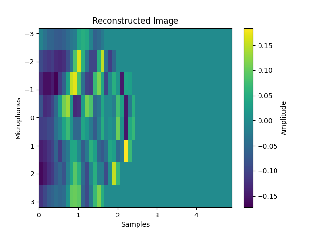 | **8 mics and Nsamp = 100**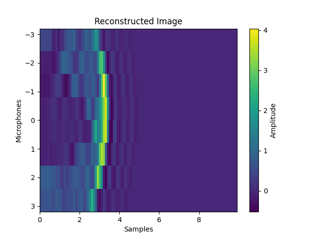 | **8 mics and Nsamp = 50**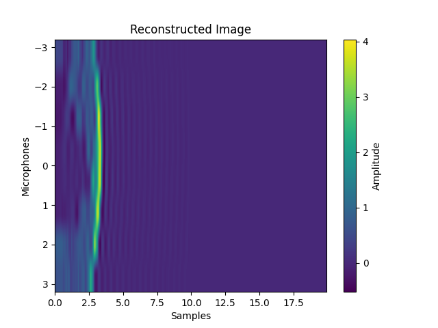 |
| --- | --- | --- |
| **32 mics and Nsamp = 50** 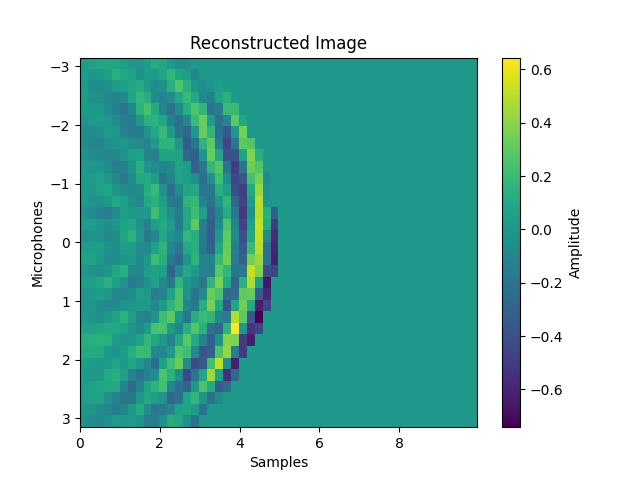 | **32 mics and Nsamp = 100** 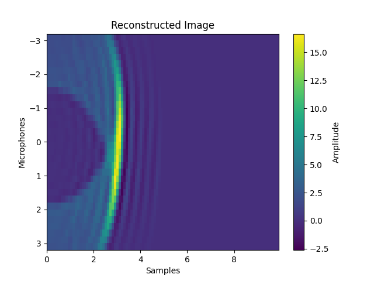 | **32 mics and Nsamp = 200** 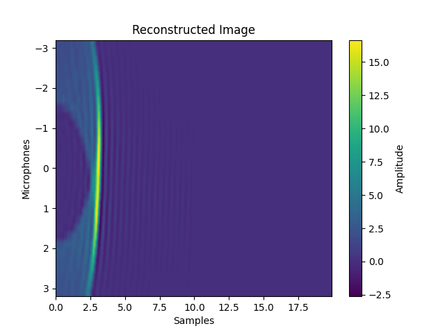 |
| **64 mics and Nsamp = 50** 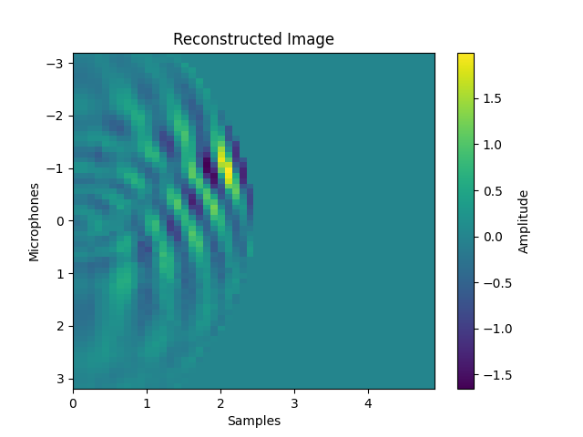 | **64 mics and Nsamp = 100** 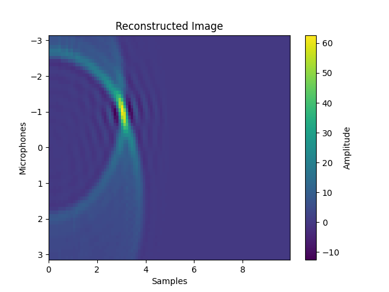 | **64 mics and Nsamp = 200** 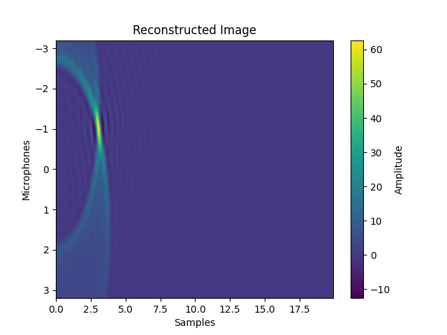 |

### These are the image obtained for datasets given:

#### rx2.txt
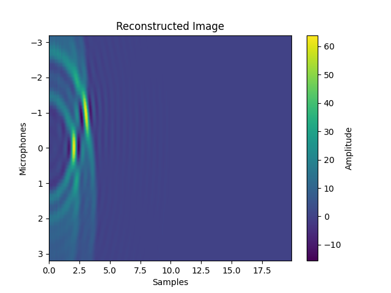
#### rx3.txt
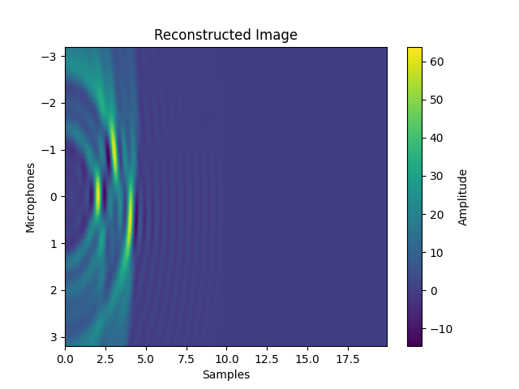
