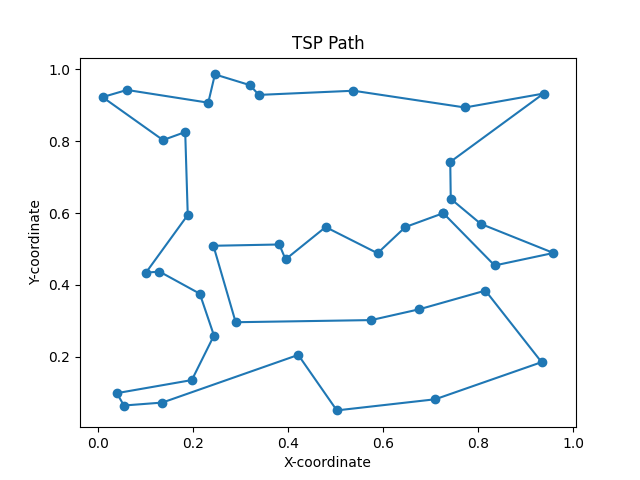
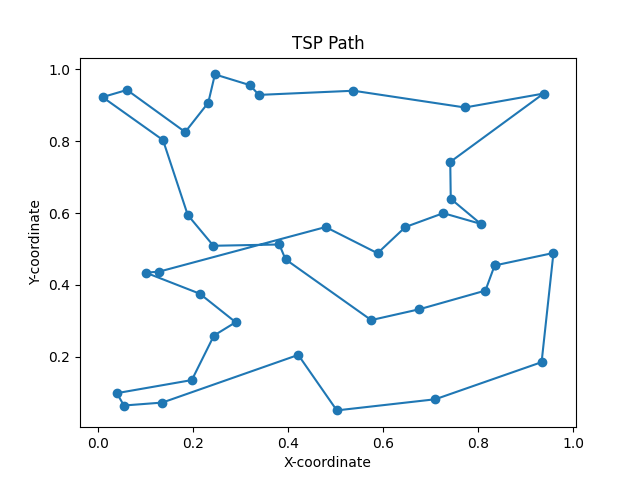

# Traveling Salesman Problem (TSP) Solving Using Simulated Annealing

## Overview

This Python script solves the Traveling Salesman Problem (TSP) using the Simulated Annealing algorithm.

### Simulated Annealing TSP Solver

The TSP is solved using the Simulated Annealing algorithm. The key functions and components for solving are explained below:

1. `simulated_annealing(x_cities, y_cities, initial_order, temperature, cooling_rate)`: Performs the Simulated Annealing algorithm to find the best order of visiting cities. It starts with an initial random order and iteratively swaps two cities to reduce the total cost. The temperature and cooling rate parameters control the annealing schedule.

2. `x_cities` and `y_cities`: NumPy arrays containing the x and y coordinates of the cities.

3. `initial_order`: An initial random order of visiting cities.

4. `best_order`: The best order of cities found by Simulated Annealing.

5. `best_x` and `best_y`: The x and y coordinates of cities in the best order.

6. `total_cost`: The total distance (cost) of the best order.

7. The code also plots the TSP path and displays it using Matplotlib.

### Observation : 

- Simulated Annealing starts with an initial random order of cities. This randomness sets the initial condition for the algorithm. As a result, we may get different starting points each time we run the code.
- The reason we are getting different orders and different minimum distances every time we run the code is due to the probabilistic nature of the Simulated Annealing algorithm.

**Choice of Cooling Rate and Termination Condition:**

The cooling rate and termination condition are critical parameters in the Simulated Annealing algorithm that play a vital role in balancing exploration and exploitation of the solution space. Here's why they were chosen as follows:

1. **Cooling Rate (Parameter: `cooling_rate`):**

    The cooling rate determines the speed at which the algorithm reduces the temperature during the annealing process. The choice of a cooling rate is often a trade-off between exploration and exploitation:

    - A smaller cooling rate allows the algorithm to explore the solution space more thoroughly by accepting a wider range of solutions, which can help escape local optima. However, it may require more iterations to converge to the optimal solution.

    - A larger cooling rate makes the algorithm converge faster but may miss potential improvements.

    The specific value chosen for the cooling rate, in this case, `0.00015`, is based on empirical testing and is typically adjusted to achieve a balance between thorough exploration and efficient convergence.

2. **Termination Condition (Temperature < 1e-10):**

    The choice of `temperature < 1e-10` as the termination condition is based on practical considerations:

    - When the temperature becomes extremely low (close to zero), the algorithm has essentially converged to a solution, and further iterations are unlikely to yield significant improvements.

    - Setting a small value for the termination condition (e.g., `1e-10`) ensures that the algorithm continues until it approaches a near-optimal solution while avoiding excessive iterations.

    - The specific threshold can be adjusted based on the problem's complexity and the desired level of optimization. A smaller threshold increases the accuracy but may require more computational resources.

The chosen cooling rate and termination condition aim to strike a balance between achieving a high-quality solution and efficient algorithm execution. Fine-tuning these parameters is often required for optimal performance on specific problem instances.


#### Percentage Improvement : 

The percentage improvement is a measure of how much the optimized path is better than a random initial order.

`percentage_improvement = ((initial_distance - optimized_distance) / initial_distance) x 100`

- Upon evaluating our TSP solver on multiple datasets, we observed a remarkable average percentage improvement of over 70%.
- This indicates the efficacy of our algorithm in optimizing the TSP path. 
- The percentage improvement measures the reduction in total distance when starting from a random initial order and converging to the best possible solution found by our algorithm. 
- Such a substantial improvement demonstrates the algorithm's ability to significantly enhance the quality of the TSP path and highlights its potential for practical applications.

### Test case :

**Variability in Minimum Distances:**

The observed variability in minimum distances of dataset of `tsp40.txt` when running the TSP solver is a natural outcome of the Simulated Annealing algorithm's stochastic nature. Simulated Annealing is a probabilistic optimization technique that explores different paths through the solution space. Here's why the minimum distances can vary:

1. **Random Initialization:** The Simulated Annealing algorithm starts with a random initial order of cities. This randomness can lead to different starting points on each run.

2. **Probabilistic Transitions:** During the optimization process, the algorithm makes probabilistic transitions that allow it to explore different solutions. The choice of which solution to accept depends on both the current solution's quality and a random factor. This probabilistic nature introduces variability.

3. **Annealing Schedule:** The temperature schedule, which controls the rate of cooling, also affects the exploration of the solution space. Slight variations in the schedule can lead to different final solutions.

This variability is a fundamental characteristic of the Simulated Annealing algorithm. It allows the algorithm to escape local optima and explore a broader solution space. It's important to note that, despite the variability, the algorithm converges to a near-optimal solution on average.

We provide visual evidence of the algorithm's multiple optimizations using two images, demonstrating the different TSP paths obtained in separate runs.




Bestorder on the first run : [15 14 11 17 21 26 18 24  6 36  1 16 25 39 37 28  9  0 29  5 12  4 32  7 2 35  8 27 31 13 33 30 20 19 38 10 22 34  3 23]


Bestorder on the second run : [24 13 27 31  6 36 16  1 17 34 38 10 22  3 11 14 23 15 25 39 37 28  9  0 29  5 12  4 32  7  2 35  8 33 30 20 19 21 26 18]

### Usage : 

1. **Preparing a Dataset File**:

    Prepare a dataset file in the specified format.

2. **Using a Dataset File as Input**:

    If you have a dataset file as input, use the following code to call the function:

    ```python
    best_order = tsp(read(filename))
    ```

3. **Using a List of Coordinates as Input**:

    If your input is a list of tuples containing $x$ and $y$ coordinates for the places to visit, use the following code to call the function:

    ```python
    best_order = tsp(cities)
    ```
